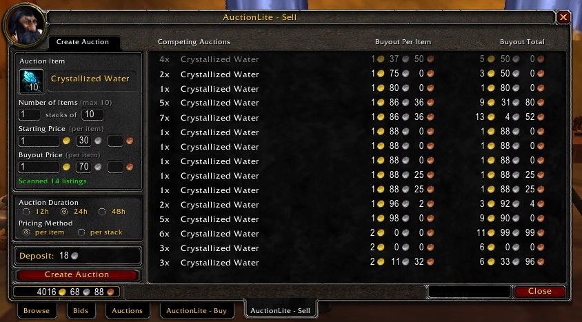

# AuctionLite-classic

Unofficial fork of AuctionLite-classic addon for World of Warcraft classic. 

origin repo : https://gitlab.com/Albirew/AuctionLite-classic/

## Overview

AuctionLite makes it easy to use the auction house!

* **Buy**
  * Show all listings for an item on a single page, sorted by per-item price
  * Buy out multiple listings at the same time
  * Search for your favorite items with a single click 
 
* **Sell**
  * Suggest prices based on the current competition
  * Create multiple listings at the same time 

* **Scan**
  * Download all auction house data in just seconds
  * Track historical prices and find deals 

* **Tooltips**
  * Show vendor, auction, and disenchant prices on all items 

In short, AuctionLite tries to make the most common auction house tasks as simple as possible, and AuctionLite strives for minimal overhead and clutter in its interface.

## Quick Start

**Buying items**: Type an item name into the "Buy" tab and click "Search". (You don't have to fill in a quantity.) Select the listings you want to buy, click "Buyout", and then click "Approve". Due to Blizzard's addon restrictions, you will have to click "Approve" once for each listing.

*    Control-right-click an item in your bags from any AH tab to search on the "Buy" tab
*    Use shift-click and control-click to select and purchase multiple listings 

**Selling items**: Drag an item from your bags into the "Sell" tab slot. Enter the number and size of the stacks you'd like to sell, adjust prices if necessary, and click "Create Auction".

*    Alt-right-click an item in your bags from any AH tab to load it into the "Sell" tab
*    Click on any competing auction to undercut that auction
*    Use the tab key to jump between fields
*    Hit enter to start the auction 

**Scanning**: Click "Full Scan" on the "Buy" tab. When scanning is complete, you'll get a list of the best deals currently available at the auction house.

*    If you navigate away from the deals page, use "Show Deals" in the "Advanced" menu to return
*    If you are disconnected during scanning, try disabling the fast scan feature (use "/al config") 

**Other features**:

*    To search for your own listings (and your competition), choose "Show My Auctions" from the "Advanced" menu
*    Click the checkmark next to any item in the "Buy" tab to mark it as a favorite, and then select "Show Favorites" from the "Advanced" menu to search for all your favorites at once
*    Go straight to your preferred tab when opening the AH
*    Open all your bags when visiting the AH 

For more details, read on!

## Buying Items

To buy an item with AuctionLite, type the name of the item you want into the "Buy" tab and click "Search" (or control-right-click an item in your bags).

If your search returns only one kind of item, you'll see a list of all auctions for that item, sorted by the per-item buyout price (or per-item bid price, if no buyout price is available). Your own auctions are shown in yellow, and auctions where you are the highest bidder will show the bid price in yellow. If you want to bid or buy out a listing, click on it, click "Bid" or "Buyout", and then approve the purchase. You can select multiple auctions by control-clicking or shift-clicking.

If your search returns multiple items, you'll see a summary of the kinds of items that your search encountered. Click on any of these summary lines to see all listings for that item, as described above. To get back to the summary page, click the arrow button in the upper-left corner of the frame.

If you know exactly how many items you want to buy, type the number into the "Quantity" field when searching. AuctionLite will then offer to fill your order by selecting the auction listings that minimize the total cost to you. AuctionLite is smart enough to find the absolute minimal cost in most cases, including cases where you can buy more items to get a lower total price. If you would like AuctionLite to consider the resale value of excess items when making this decision (e.g., you ask for 10 items, but you'd rather get 11 at 101g than 10 at 100g), then you can enable the "Consider Resale Value" option (use "/al config"). If AuctionLite suggests purchasing more items than you originally requested (for any reason), it will show you to the expected resale value of the excess items and the net cost of the items you requested.

AuctionLite will incorporate all of the price data that your searches return into its historical data. Thus, the prices for items you frequently purchase will always be up to date, even if you don't do full auction house scans.

### Favorites
On the "Buy" tab's summary display, you can click on the checkmark to the left of any item to mark it as a favorite (click again to unmark). Then, you can choose "Show Favorites" in the "Advanced" menu to quickly search for all of your favorites. Your favorites will also get bumped to the top of the summary display in any future search.

If you'd like to create multiple favorites lists, you can do so in the AuctionLite configuration screen (use "/al config"). Your lists will show up in a submenu of the "Show Favorites" menu option. When creating a favorites list, you can type any item name, but you must type the entire name exactly as it appears in-game (case does not need to match). You can also drag-and-drop items into the "Add an Item" field.

### Your Auctions
In order to see auctions that you're selling, choose "Show My Auctions" from the "Advanced" menu. AuctionLite will search for all your current auctions so that you can see your competition. On the summary screen, any items where you've been undercut will be shown with a red background.

If you'd like to cancel an auction, just click the item, select your listing(s), and click "Cancel". You can select and cancel multiple auctions by using shift-click and control-click.

If you'd like to cancel auctions in bulk, you can do this in a number of ways. First, clicking the "Cancel" button when nothing is selected will cancel all auctions on that page (and all auctions period, if you're on the summary screen!). Second, control-clicking the "Cancel" button will cancel all such auctions that have been undercut (i.e., auctions that have a competitor at a lower per-item price). Finally, you can right-click any line in the summary screen in order to cancel all auctions or cancel undercut auctions.

## Selling Items

To sell an item with AuctionLite, start by dragging the item into the box on the "Sell" tab (or by alt-right-clicking an item in your bags). AuctionLite will immediately scan for all competing auctions, and it will suggest an appropriate price for your auction. In addition to setting bid and buyout prices, you can also tell AuctionLite to post multiple stacks of a certain size.

AuctionLite will display a list of competing auctions so that you can verify the accuracy of AuctionLite's suggestions. Any listings shown in gray are listings that AuctionLite considered to be outliers--that is, listings with abnormally low prices. AuctionLite typically chooses a price that is just less than the lowest non-outlier price, since this price is a reasonable estimate of the market-clearing price. If you disagree with AuctionLite's estimate of the market-clearing price, you can click on any auction in the display to undercut it by a few percent. Listings shown in yellow are your own auctions; clicking on them will fill in the prices you set for those auctions.

AuctionLite also shows some historical data for your item in the chat window. Every time AuctionLite scans for an item, it will incorporate the latest prices into its historical data, weighted according to the frequency of its scans.

If you want to sell items quickly, you can use alt-right-click even on the "Browse" tab in order to move an item into the "Sell" tab. If you approve of AuctionLite's initial suggestions, hitting enter will post the auction immediately.

If you'd like to save settings for a particular item, click the down arrow near the item slot in the "Sell" tab. Selecting any of these options will save your current stack size, stack count, or prices for future use.

AuctionLite's pricing scheme can be customized in the AuctionLite options screen (Escape -> Interface -> Addons -> AuctionLite).

## Scanning

You can tell AuctionLite to scan all listings in the auction house by clicking the "Full Scan" button on the "Buy" tab.

After all auction data has been retrieved, AuctionLite will analyze the data and record the current market prices for later use. AuctionLite will take into account how frequently and how recently you've scanned, so there's no need to worry about how often you scan. Note that if you cancel the scan by closing the auction house, no data will be recorded.

AuctionLite also stores all price data from your scans in the "Buy" and "Sell" tabs, so even if you don't scan frequently, the prices for items that you buy and sell will stay up to date.

### Deals
After you've completed a full scan, AuctionLite will search for all items in the auction house that are underpriced relative to previous scans, and it will show you these items ranked by potential profit. If you navigate away from this screen, you can recall the list of deals from the last scan of your current AH visit by going to "Advanced" and clicking "Show Deals". To set the parameters for this search, go to the AuctionLite options screen (in the "Advanced" menu) and set the minimum profit and the minimum discount relative to previous prices.

## Tooltips

AuctionLite adds a few lines to the bottom of each item tooltip in the game to show the vendor sell price, the expected disenchant value, and the estimated auction house value. The disenchant value is based on the current value of the disenchanted dust/essences/shards at the auction house.

By default, AuctionLite shows the value for the entire stack. However, if you'd like to see the per-item price instead of the per-stack price, just hold the shift key. If you'd like this to be the other way around (i.e., per-item prices normally, and per-stack prices when holding shift), this setting can be adjusted in the AuctionLite options screen (type "/al config").

If you'd rather not see AuctionLite's information in tooltips, they can be customized or disabled in the AuctionLite options screen (type "/al config"). You can set each line in the tooltip so that it always appears, never appears, or appears only if the applicable data is available (e.g., if we have an auction house price for that item).

## External API

AuctionLite supports Tekkub's GetAuctionBuyout interface, so any addon that uses this interface will automatically be able to retrieve price data from AuctionLite.

In addition to this standard interface, other addons that wish to use AuctionLite's data can use the following methods:

price = AuctionLite:GetDisenchantValue(link or id[, suffix]) price = AuctionLite:GetAuctionValue(link or id[, suffix])

These methods return AuctionLite's disenchant and auction prices, which are the same numbers you see in the tooltips. You can pass an item string, an item link, or an item ID, but note that if you pass an ID for an item that typically has a suffix (e.g., "of the Monkey"), then you need to provide the suffix as the second argument. AuctionLite doesn't track bid prices--just buyout prices.

## Acknowledgments

Huge thanks to Cybeloras for keeping AuctionLite up to date with the most recent WoW API changes!

Thanks to mysticalos, kolenka, phanx, inexstinctus, vebev, and haghala for contributing bug fixes and features, and thanks to the Curse/WowAce/WowInterface community for their bug reports and suggestions.

Many, many thanks to the folks who took the time to translate AuctionLite to other languages!

* Brazilian Portuguese: phalk, renanwar
* French: Pettigrow, FreakyGreaser
* German: nesta666, Farook, archiv, callmechris, tholas1234, hero66
* Italian: _YuSaKu_, kappesante
* Korean: eljei, san0713, kdw112, maknae, netaras, Sayclub, ohmytrance
* Russian: Vampik, RustamIrzaev, StingerSoft, aperionfag, KVVV
* Simplified Chinese: tnt2ray, wowuicn, dh0000
* Spanish: karrash76, virginc
* Traditional Chinese: tnt2ray, a9012456, s8095324, zhTW 
